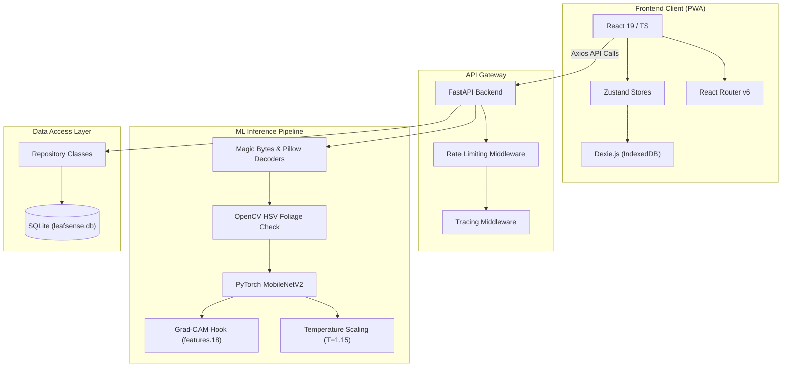
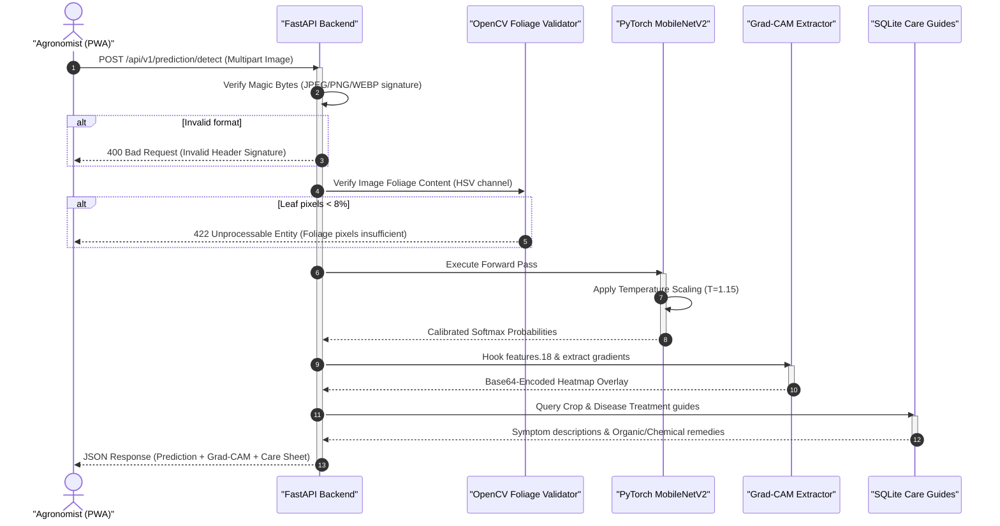

# LeafSense AI 🌿

> **LeafSense AI** is a production-grade diagnostic platform that combines computer vision, explainable AI (XAI), and offline-first edge architecture to classify crop foliage diseases and outline actionable organic & chemical treatment care sheets.

### 🔗 Live Deployments
* **Live Web Demo**: [https://Rishisharma029.github.io/AgriVision/](https://Rishisharma029.github.io/AgriVision/)
* **Interactive API Spec**: [http://127.0.0.1:8050/docs](http://127.0.0.1:8050/docs) (when running locally)

---

## 📖 Table of Contents
1. [Key Features](#-key-features)
2. [System Architecture](#-system-architecture)
3. [Repository Directory Structure](#-repository-directory-structure)
4. [Diagnostic & Inference Pipeline](#-diagnostic--inference-pipeline)
5. [Local Development Setup](#-local-development-setup)
   - [FastAPI Backend Setup](#1-fastapi-backend-setup)
   - [React Frontend Setup](#2-react-frontend-setup)
6. [Security & Verification Controls](#-security--verification-controls)
7. [License](#-license)

---

## ✨ Key Features
* **Calibrated AI Diagnostic Gateway**: Powered by a custom PyTorch CNN (MobileNetV2) trained on diverse foliage datasets with temperature-scaled confidence thresholds.
* **Explainable AI (Grad-CAM)**: Highlights the exact visual coordinates and lesions on the leaf that led to the model's prediction. Includes a real-time opacity slider overlay.
* **Offline-First Storage**: Archives scan histories locally using Dexie.js (IndexedDB) so agronomists can run diagnostics in low-connectivity fields.
* **Cyber-Tech Agronomy HUD**: A responsive layout built using React 19, TypeScript, Tailwind CSS, and Framer Motion featuring a live radar/HUD scanning interface.
* **Production-Grade FastAPI Gate**: Fully armed with request correlation tracing, structured Loguru logs, Magic Bytes file validation, HSV pixel check (foliage detection), and IP-based rate limiting.

---

## 🏗️ System Architecture

The client-side React PWA runs fully independently of cloud storage, synchronizing with IndexedDB and connecting to the FastAPI gateway via proxied `/api` routes:



---

## 📁 Repository Directory Structure

```text
AgriVision/
├── .github/                   # GitHub action workflows
├── ai/                        # ML model training notebooks and training scripts
├── backend/                   # FastAPI backend gateway
│   ├── app/
│   │   ├── ai/                # Checkpoints & loading scripts
│   │   ├── api/               # V1 REST routes (crops, diseases, prediction)
│   │   ├── core/              # Settings & paths configs
│   │   ├── database/          # SQLite schema & DB sessions
│   │   ├── middleware/        # Rate limiter & correlation UUID tracing
│   │   ├── services/          # Care sheet DB seeding scripts
│   │   └── main.py            # FastAPI API Gateway Entrypoint
│   ├── migrations/            # Alembic DB migration files
│   ├── tests/                 # Pytest test cases
│   ├── requirements.txt       # Python dependencies
│   └── alembic.ini            # DB migration configs
├── docs/                      # Technical specification pages
├── docker/                    # Docker container build files
├── frontend/                  # React 19 + TypeScript + Vite Client
│   ├── src/
│   │   ├── components/        # Layout, 3D, and UI components
│   │   ├── design-system/     # Design tokens and semantic themes
│   │   ├── pages/             # App pages (Home, Scan, Encyclopedia)
│   │   ├── store/             # Zustand application state stores
│   │   ├── utils/             # Image compressors & base64 tools
│   │   ├── App.tsx            # Main application router and providers
│   │   └── main.tsx           # React mounting entrypoint
│   ├── index.html             # Vite index file
│   ├── package.json           # Frontend scripts and dependencies
│   └── vite.config.ts         # Vite configuration and proxy setups
├── infrastructure/            # Nginx configurations & Docker compose
├── research/                  # Scientific reports and model cards
└── README.md                  # This file
```

---

## 🔍 Diagnostic & Inference Pipeline

The diagram below details the validation and inference workflow when an image payload is uploaded to the backend:



---

## 🚀 Local Development Setup

### Prerequisite Versions
* **Node.js**: `v20.0.0` or higher (Tested with `v25.8.1`)
* **Python**: `v3.10` or higher (Tested with `v3.11`)

---

### 1. FastAPI Backend Setup

1. Navigate to the backend directory:
   ```bash
   cd backend
   ```
2. Create and activate a Python virtual environment:
   ```bash
   python -m venv venv
   # On Windows:
   venv\Scripts\activate
   # On Mac/Linux:
   source venv/bin/activate
   ```
3. Install dependencies:
   ```bash
   pip install -r requirements.txt
   ```
4. Start the FastAPI server on port `8050`:
   ```bash
   python -m uvicorn app.main:app --host 127.0.0.1 --port 8050
   ```
   * *Swagger interactive API documentation will be available at [http://127.0.0.1:8050/docs](http://127.0.0.1:8050/docs)*.

---

### 2. React Frontend Setup

1. Navigate to the frontend directory:
   ```bash
   cd frontend
   ```
2. Install frontend dependencies:
   ```bash
   npm install
   ```
3. Start the Vite development server:
   ```bash
   npm run dev
   ```
4. Open the application in your browser at [http://localhost:5173/](http://localhost:5173/).

---

## 🔒 Security & Verification Controls

LeafSense AI incorporates strict verification guards to ensure diagnostic reliability:
* **Magic Bytes Filtering**: Checks file signature headers in memory before decoding to prevent arbitrary file upload execution.
* **Foliage Detection (HSV)**: Uses OpenCV to ensure the uploaded image has at least 8% green/foliage pixels. This prevents users from uploading generic images or self-portraits.
* **IP Throttling**: Limits clients to 30 requests per minute (`RateLimitMiddleware`) to prevent API abuse.
* **Request Correlation**: Automatically adds an `X-Correlation-ID` header to all logs, making transactions fully traceable across service layers.

---

## 📄 License
Distributed under the MIT License. See [LICENSE](LICENSE) for more information.
