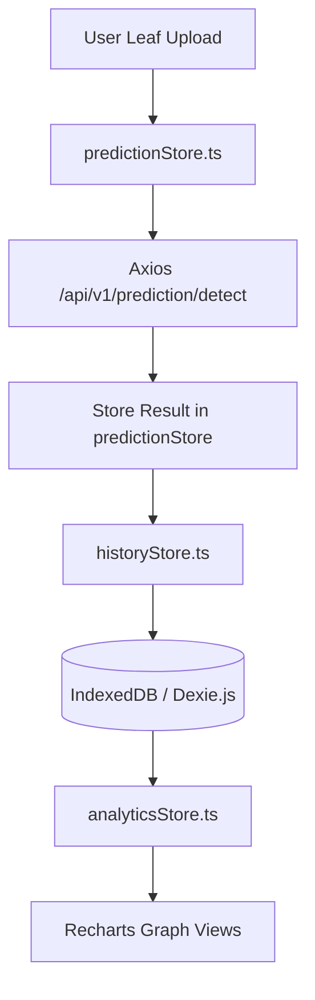

# LeafSense AI – Frontend Architecture Specification (v1.0)

LeafSense AI is built as a single-page application using React 19, TypeScript, Tailwind CSS, Zustand, and React Three Fiber (Three.js).

---

## 1. UI Design System

We employ a custom dark-mode-first aesthetic with a curated color palette:
- **Primary (Green)**: `#16a34a` (Success foliage green)
- **AI Accent**: `#3b82f6` (Tech blue)
- **Dark Background**: `#0f172a` (Slate-900)
- **Glassmorphism Base**: Semi-transparent backgrounds (`bg-white/40` or `bg-slate-900/40`) blended with `backdrop-blur-md` and thin border rings (`border-white/10` or `border-slate-800/40`).
- **Typography**: Google Fonts Outfit family for display elements, Inter for body copy.

---

## 2. Zustand State Management Flow

Zustand stores are separated to enforce the Single Responsibility Principle:



- **themeStore**: Persists the active user theme (`light` or `dark`) in `localStorage`.
- **predictionStore**: Manages diagnostic timelines: `idle` ➔ `validating` ➔ `compressing` ➔ `uploading` ➔ `inferring` ➔ `gradcam` ➔ `reporting` ➔ `completed`.
- **historyStore**: Reads and writes scan details (Base64 source images, Grad-CAM images, and metadata) locally using Dexie.js.

---

## 3. WebGL 3D Scanning Canvas (`ScanningLeaf3D.tsx`)

The scanning interface runs inside a React Three Fiber `<Canvas>` wrapper:
- **Leaf mesh**: Generated using an extruded `<extrudeGeometry>` with custom shape contours mapping a standard botanical leaf profile.
- **Sweep Laser**: Animated green flat box mesh sweeping vertically across the Y-axis. The laser is powered by a sine-wave driver inside a R3F `useFrame` hook:
  ```typescript
  useFrame((state) => {
    const time = state.clock.getElapsedTime();
    laserRef.current.position.y = Math.sin(time * 2.0) * 1.5;
  });
  ```
- **Particle System**: Renders 100 random vertex points (`<points>`) with an offset function to simulate floating spores in 3D space.

---

## 4. PWA Strategy (`vite-plugin-pwa`)

- **precaching**: Pre-compiles assets (HTML, CSS, JS, and font formats) into static caches.
- **Service Worker**: Generates `sw.js` in `generateSW` mode.
- **Offline Fallback**: Intercepts failed network page fetches to serve precached files, enabling the diagnostics dashboard to run in completely offline environments.
