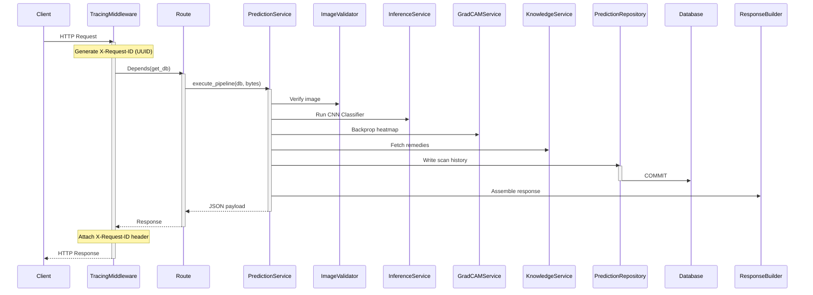

# LeafSense AI – Backend Architecture Specification (v1.0)

The backend is built as a service-oriented FastAPI application that isolates ML model inference, data access, and agricultural knowledge domains.

---

## 1. Directory Structure

```text
backend/app/
 ├── api/v1/                # Endpoint controllers
 ├── core/                  # Configurations and paths
 ├── database/              # Engine, session, and declarative base
 ├── middleware/            # Tracing and execution timers
 ├── models/                # SQLAlchemy 2.0 entities
 ├── monitoring/            # Health and metric telemetry
 ├── repositories/          # CRUD repository helpers
 ├── schemas/               # Pydantic validation models
 ├── services/
 │    ├── knowledge/        # Seeding and query services
 │    ├── image_service.py
 │    ├── inference_service.py
 │    └── gradcam_service.py
 └── main.py                # Entry point
```

---

## 2. Layered Request Flow

Every API interaction follows a structured sequence:



---

## 3. Warm Startup Lifecycle

We utilize FastAPI lifespan handlers to pre-populate caches and warm up the CNN:
1. **Schema Check**: Calls `Base.metadata.create_all(bind=engine)` to compile tables.
2. **Seeding check**: Calls `seed_database(db)` to insert botanical profiles if database tables are blank.
3. **Model Warmup**: Calls `ModelRegistry.get_active_model()`, loading the PyTorch `leafsense_1.0.0.pth` checkpoint weights into memory and running a dummy tensor forward pass.

---

## 4. Middleware & Request Tracing

`TracingMiddleware` intercepts every incoming HTTP request:
- Generates a UUID string and registers it in Python's thread-local `contextvars`.
- Loguru automatically reads this context and prints the request ID in all logs inside that request thread.
- Measures process timings and injects response headers:
  - `X-Request-ID`: Correlation UUID
  - `X-Process-Time-Ms`: Execution duration
