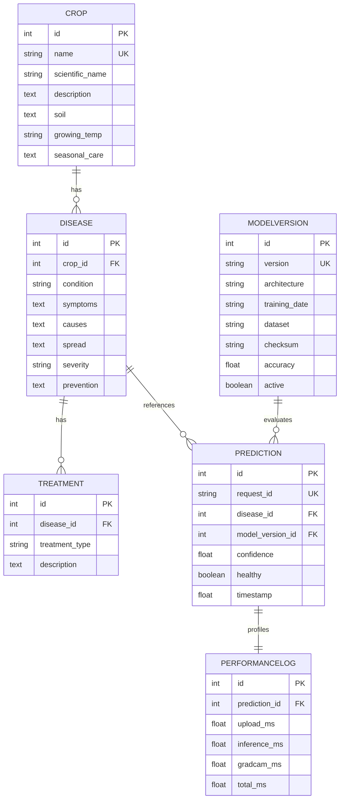

# LeafSense AI – Database Design Specification (v1.0)

We use SQLAlchemy 2.0 ORM with a SQLite database for development, ready to scale to PostgreSQL in production.

---

## 1. Entity Relationship (ER) Diagram

---

## 2. Table Data Dictionary

### Table: `crop`
Stores target crop botanical parameters.
- **id** (INTEGER, Primary Key): Unique auto-incrementing ID.
- **name** (VARCHAR(50), Unique, Indexed): Crop name (e.g. `Tomato`).
- **scientific_name** (VARCHAR(100)): Scientific nomenclature (e.g. `Solanum lycopersicum`).
- **description** (TEXT): General crop profile.
- **soil** (TEXT): Soil pH and texture requirements.
- **growing_temp** (VARCHAR(50)): Ideal temperature bounds.
- **seasonal_care** (TEXT): Crop growth seasonal checklist.

### Table: `disease`
Stores pathology profiles for crop diseases.
- **id** (INTEGER, Primary Key): Unique ID.
- **crop_id** (INTEGER, Foreign Key ➔ `crop.id`): Crop classification owner.
- **condition** (VARCHAR(100), Indexed): Disease name (e.g. `Early Blight` or `Healthy`).
- **symptoms** (TEXT): Diagnostic symptoms description.
- **causes** (TEXT): Biological pathogens causing the disease.
- **spread** (TEXT): Spore transmission vectors.
- **severity** (VARCHAR(50)): Classification gravity (`Critical`, `High`, `Medium`, `None`).
- **prevention** (TEXT): Preventative strategies.

### Table: `treatment`
Stores remediation lists.
- **id** (INTEGER, Primary Key): Unique ID.
- **disease_id** (INTEGER, Foreign Key ➔ `disease.id`): Associated pathology.
- **treatment_type** (VARCHAR(50), Indexed): Categorization (`organic`, `chemical`, `fertilizer`, `soil_moisture`, `action_item`).
- **description** (TEXT): Step-by-step guideline.

---

## 3. Database Constraints & Indexes

- **uq_crop_disease_condition**: Enforces unique combinations of `crop_id` and `condition` in the `disease` table.
- **uq_prediction_request_id**: Enforces UUID uniqueness in predictions to avoid duplicates.
- **uq_performance_prediction_id**: Enforces `1:1` mapping between `prediction` and `performance_log`.
- **Foreign Keys**: Configured with `ondelete="CASCADE"` for cascade deletions (e.g. removing a crop automatically clears its diseases and treatments), except in `prediction` which uses `ondelete="RESTRICT"` to preserve history logs.
